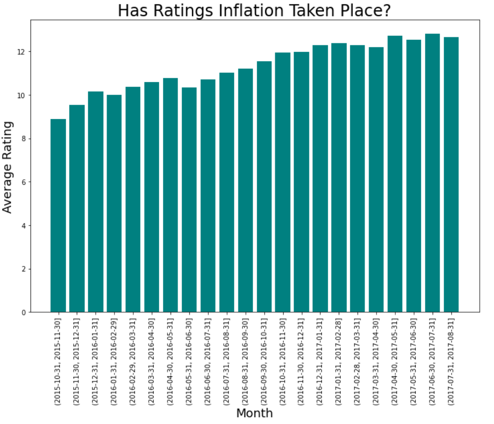
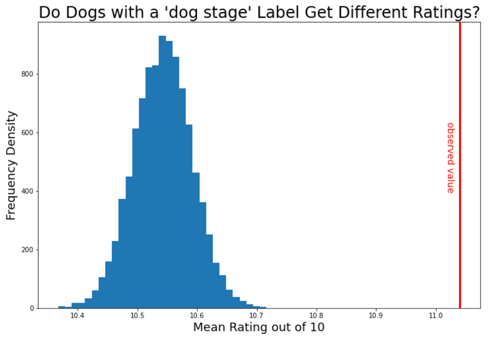

[WeRateDogs](https://twitter.com/weratedogs) is a popular account on Twitter that shamelessly objectifies bitches by assigning them ratings based on photos. In truth, it does this to male dogs as well, but still, it’s something of a minor miracle they haven’t yet been cancelled.  In the era of #metoo, it would appear no one gives a #scoobydoo when it comes to dogs.

One of the difficulties of employing a public-facing rating system, however, is that they are subject to Goodhart’s law - "Every measure which becomes a target becomes a bad measure”. Although WeRateDogs justifies their mathematically upside-down rating system, in which dogs are regularly given ratings out of ten that in excess of ten, by telling us that “They’re good dogs, Brent”, they may have a larger problem on their hand – ratings inflation. Looking at the period from November 2015 to August 2017, one can see a definite pattern:

The problem is obvious – ratings from an earlier period of time are delegitimised by the later ratings. It has ceased to become a useful measurement. So why have they done this? For the retweets, of course! We get an idea of just how powerful it is to give a dog a higher rating when we compare it to something we know is quite powerful – tweeting at the right time of day. If we designate the 10:00-13:00 EST/07:00-10:00 PST and 18:00-21:00 EST/15:00-18:00 PST as peak times, and everything else as off-peak, we can explain about 0.8% of the variance in how popular a particular tweet will be (i.e. how many times it will be retweeted). But the same figure (known as the r2 ) given to the dog is much higher at 9.1%. Small wonder the staff at WeRateDogs have been tempted to give higher and higher ratings!

Something else we might be interested in is what sort of tweet gets the higher rating scores. Do we, as we do when it comes to human beings, prioritise youth? A good way to answer this is to look at dogs who are given a ‘dogstage label’ – i.e. are called a ‘doggo’, ‘floofer’, ‘puppo’, or ‘pupper’. If youth is prioritised even in our canine friends, we’d expect those with such assignations to fare better in this cruel sport that toys with the self-esteem of dogs.

Sure enough, dogstage labelled dogs have a mean score of 11.04, which would appear to be higher than the general average of 10.54. But is it statistically significant? If you simulate 10,000 values on the assumption that dogstage labelled dogs have the same average rating as every other dog, and you compare it to this observed value of 11.04, here’s what you see:

The observed value is well outside of what you’d expect if the dogstage labelled dogs were rated just the same, so it’s clear that we have very strong evidence here that the dogstage labelled dogs get different ratings. Specifically, they get higher ratings.

However, if we look a little more closely and examine the effect of each label individually on dog rating, we see a more complicated pattern. If we fit a multiple linear regression, we get very low p-values for 'is_doggo' and 'is_puppo', indicating that we have very strong evidence that there is an association between a dog being designated a 'doggo' or a 'puppo' and its rating. Specifically, a 'doggo' has (other things being equal) a 1.42 higher rating on average than a dog without a dogstage label, and for a 'puppo' it's 1.55.

It's possible that it's the same story for 'floofer's, but the result isn't statistically significant (p = 0.060) due to the low number of such cases (n = 7). Similarly, we fail to get any evidence that being categorised as both a ‘doggo’ and a ‘floofer’/’pupper’/’puppo’ yields any difference in rating compared to having no designation at all, again probably due to the low number of such cases. Most curiously, however, there is little-to-no evidence (p = 0.241) that a dog being designated a 'pupper' has any effect on its rating. So it’s not quite as simple as favouring youth – a small puppy is not associated with a different rating, but a big puppy (i.e. a ‘doggo’ or a ‘puppo’) is associated with a higher rating.
